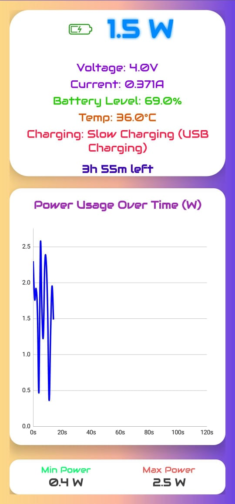
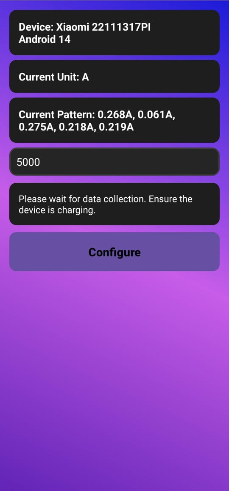
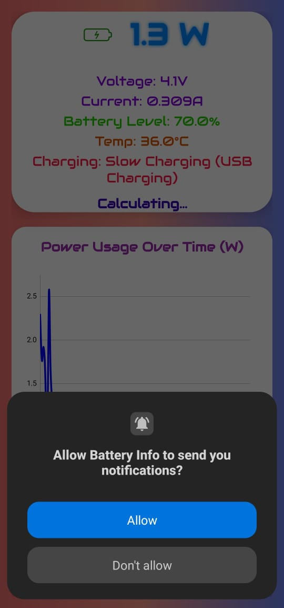
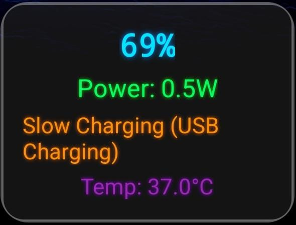

# 🔋 Battery Info App

A modern Android application that provides real-time monitoring of your device’s **charging power**, **battery percentage**, and **estimated time remaining**. Built with performance and visual clarity in mind, it features a sleek light-themed UI and smooth animations.

---

## ✨ Features

- ⚡ **Charging Power** displayed live in watts (W)
- 📊 **Live Graph** showing power trend over the last 2 minutes
- 🔋 Real-time **Battery Percentage** and **Time Remaining**
- 🕒 **Persistent Notification** that updates every second
- 📱 **Home Screen Widget** with interactive tap-to-open functionality
- 🎨 **Light Theme** UI with smooth transitions and particle background
- 🛠️ **One-Time Configuration** screen to detect device specs and units

---

## 📸 Screenshots

### 🔋 Main Screen


### Configuration Screen


### Nofification Screen


### Widgets Screen


### Notification


---

## 🚀 Getting Started

### Prerequisites

- Android Studio (Arctic Fox or newer)
- Kotlin DSL for Gradle
- Android SDK 26 or above
- Git

### Build Instructions

```bash
git clone https://github.com/your-username/battery-info-app.git
cd battery-info-app
